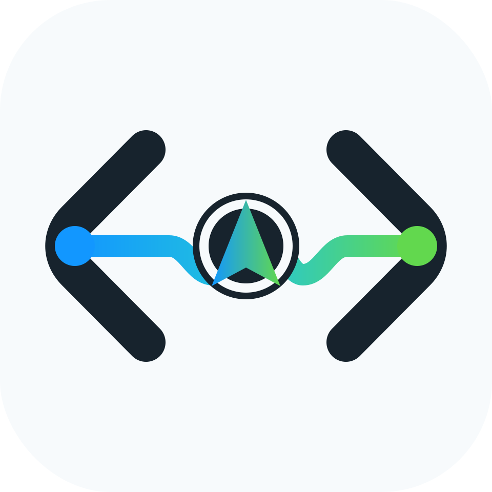

# Navo



Safe model navigation for Codex and OpenCode.

Navo is an Ollama-style helper for using OpenCode Go subscription models in Codex App and Codex CLI. It configures Codex safely, runs a local Responses-to-Chat adapter, gives you fast model switching, and logs enough routing metadata to prove which upstream model was used without logging prompts or API keys.

## Guides

- [Getting Started](docs/GETTING_STARTED.md)
- [Troubleshooting](docs/TROUBLESHOOTING.md)
- [Architecture](docs/ARCHITECTURE.md)
- [Publishing](docs/PUBLISHING.md)
- [Launch Checklist](docs/LAUNCH_CHECKLIST.md)
- [Contributing](CONTRIBUTING.md)
- [Security](SECURITY.md)
- [Changelog](CHANGELOG.md)

## Why Developers Star Navo

- It makes Codex native and OpenCode Go model switching explicit instead of mysterious.
- It gives privacy-safe proof with `navo verify --fresh` and activity logs.
- It has a local dashboard for people who do not want to hand-edit TOML.
- It keeps recovery simple with backups, native-mode switching, and `navo off`.

## Why Navo Exists

Codex custom providers use the Responses API wire format:

```toml
wire_api = "responses"
```

OpenCode Go exposes OpenAI-compatible Chat Completions:

```text
https://opencode.ai/zen/go/v1/chat/completions
```

Navo runs a local OpenCode connection on `127.0.0.1`. Codex talks Responses API to Navo, and Navo forwards Chat Completions requests to OpenCode Go.

## Install

After publish:

```bash
npm install -g navo
```

Local development:


```bash
npm link
```

Primary command:

```bash
navo help
```

## Quick Start

```bash
navo login
navo app --model deepseek-v4-flash
```

That will:

1. Store your OpenCode Go API key in macOS Keychain, falling back to a chmod `0600` file.
2. Back up `~/.codex/config.toml`.
3. Write `~/.codex/navo-models.json` so Codex can see OpenCode Go models.
4. Configure Codex to call `http://127.0.0.1:17853/v1`.
5. Start the local OpenCode connection.
6. Open Codex App.

## Daily Commands

```bash
navo on                         # configure Codex + start OpenCode mode
navo off                        # restore normal Codex config + stop OpenCode mode
navo app                        # turn on + open Codex App
navo ui                         # start or focus the persistent local dashboard
navo ui-stop                    # stop the dashboard server
navo status                     # show active config, key, OpenCode connection, routing
navo verify --fresh             # fail if Codex can still use the OpenAI path or proof is stale
navo logs --lines 30            # privacy-safe OpenCode proof
navo backups                    # inspect restore backups
navo version                    # print installed version
```

After `navo on`, `navo off`, `navo model`, or `navo route`, restart Codex App or start a new thread/session so Codex reloads config.

## Dashboard

Start the local control panel:

```bash
navo ui
```

Then open:

```text
http://127.0.0.1:17854
```

`navo ui` starts the dashboard in the background, opens Chrome, prints the URL, and exits. The dashboard keeps running after the terminal closes. Use `navo ui-stop` to stop it, `navo ui-status` to inspect it, or `navo ui --foreground` when developing the dashboard itself.

The dashboard can switch provider mode, start OpenCode, open Codex App, test your OpenCode API key, inspect safe activity logs, and restore non-Navo config backups. It binds to `127.0.0.1` only.

The header shows a safety pill:

```text
OpenCode fresh -> Navo is configured and recent OpenCode traffic is proven
OpenCode ready -> Navo is configured; run a probe or new turn for fresh proof
OpenAI risk    -> Codex is not fully routed through Navo
```

Use a separate UI port if needed:

```bash
navo ui --port 17855
```

If your OpenCode connection is on a non-default port:

```bash
navo ui --opencode-port 17860
```

## Model Selection

Run an arrow-key selector:

```bash
navo model
```

Or switch directly:

```bash
navo model deepseek-v4-flash
navo model glm-5.1
navo model deepseek-v4-pro
navo model kimi-k2.6
```

Switch back to a native Codex/OpenAI model:

```bash
navo codex-model
navo codex-model gpt-5.5
navo codex-model gpt-5.4
```

The dashboard shows separate selectors for OpenCode models and Codex native models. Use **Use OpenCode Mode** to install the Navo OpenCode provider and start the OpenCode connection, and **Use Codex Native** to remove the Navo provider/catalog and switch Codex back to its native model path. Dashboard switches restart Codex App automatically so the next session uses the selected provider.

Current Codex App builds may expose reasoning controls without exposing a custom-provider model picker. Navo switches the model through Codex config, which the App reads when it starts or opens a new session.

Existing Codex chats do not reliably reload provider/model changes in place. The dashboard restarts Codex App after mode/model switches. If you switch from the CLI, restart Codex App or open a new chat in the same project. Your project files stay the same; the new chat is how Codex reloads the provider config.

## Chat vs Agent Routing

Codex documents `plan_mode_reasoning_effort`, not a separate `plan_mode_model`. Navo can approximate split-model behavior at the OpenCode connection:

```bash
navo route
navo route --chat glm-5.1 --agent deepseek-v4-flash
navo route off
navo restart
```

Routing rule:

```text
No tools in request -> chat/planning model
Tools in request    -> agent/execution model
```

Activity logs include both the requested model and routed model:

```text
route=chat  model=glm-5.1             requested_model=deepseek-v4-flash upstream_model=frank/GLM-5.1
route=agent model=deepseek-v4-flash   requested_model=glm-5.1             upstream_model=deepseek-v4-flash
```

If you see `requested_model=gpt-...` and `model=deepseek-v4-flash`, Codex requested a native-looking model name but Navo forced the OpenCode route. That is expected while Navo routing is enabled. To truly use a Codex native model, switch with `navo codex-model <model>` or the dashboard **Use Codex Native** action, then restart Codex App or start a new session.

## Verify Routing

```bash
navo status
navo verify
navo verify --fresh
navo guard --fix
navo probe-routing
navo probe-proxy --model deepseek-v4-flash
navo logs --lines 20
```

`navo verify` exits nonzero when the active Codex config is not using Navo. `navo verify --fresh` also requires recent OpenCode proof. `navo guard --fix` rewrites the Navo provider config and starts the OpenCode connection. Restart Codex App or start a new Codex session after fixing config; an already-running session may keep using the model it started with.

Good log lines look like:

```text
status=200 model=deepseek-v4-flash upstream_host=opencode.ai upstream_path=/chat/completions upstream_model=deepseek-v4-flash
```

The logs do not include prompts, message content, headers, or API keys.

Do not rely on asking the assistant which model it is. Use `navo verify` and the OpenCode connection log. If a Codex turn is using Navo, the OpenCode connection log will get a fresh `POST path=/v1/responses` line with `upstream_host=opencode.ai`.

## Supported OpenCode Go Models

Navo defaults to models documented for OpenCode Go's OpenAI-compatible Chat Completions endpoint:

- `deepseek-v4-flash`
- `kimi-k2.6`
- `glm-5.1`
- `deepseek-v4-pro`
- `kimi-k2.5`
- `glm-5`
- `mimo-v2.5-pro`
- `mimo-v2.5`

OpenCode Go also lists models on an Anthropic-compatible Messages endpoint. Navo keeps those out of Codex routing by default because the local OpenCode adapter targets Codex's Responses API flow.

## Safety

Navo writes backups before changing Codex config and labels them:

```text
restore  -> normal Codex config
opencode -> Navo-managed config
```

Undo:

```bash
navo off
```

Manual restore:

```bash
navo backups
navo restore --backup /path/to/backup.toml
navo proxy-stop
```

Navo state lives under `~/.navo`.

## What Gets Written

Codex config receives a managed provider block:

```toml
model = "deepseek-v4-flash"
model_provider = "opencode-go"
model_catalog_json = "/Users/you/.codex/navo-models.json"

[model_providers.opencode-go]
name = "OpenCode Go"
base_url = "http://127.0.0.1:17853/v1"
wire_api = "responses"
supports_websockets = false

[model_providers.opencode-go.auth]
command = "/path/to/node"
args = ["/path/to/bin/navo.mjs", "token"]
timeout_ms = 5000
refresh_interval_ms = 300000
```

## Development

```bash
npm run check
node bin/navo.mjs help
```

Navo has no runtime npm dependencies.

If Navo saves you setup time, star the GitHub repo so more Codex and OpenCode users can find it.
