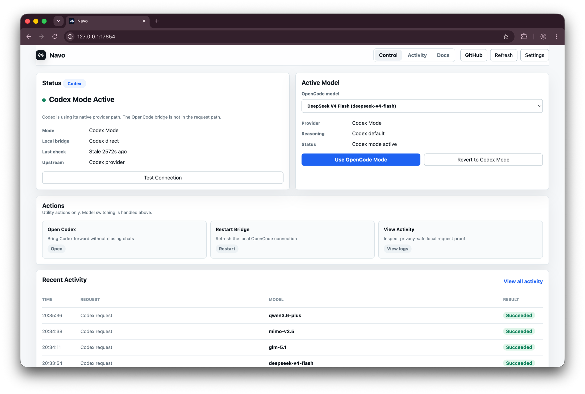

# Navo

Use Codex with Codex native models or OpenCode Go models, with local proof of where requests went.

[](https://www.npmjs.com/package/@rebel0x/navo)
[](https://github.com/rebel0789/navo/actions)
[](LICENSE)

Navo is a local bridge for Codex App and Codex CLI. It configures Codex to call a local Responses API adapter on `127.0.0.1`, forwards requests to documented OpenCode Go endpoints, and records privacy-safe routing metadata. Your OpenCode API key stays on your machine.



## Start

Run without installing globally:

```bash
npx -y @rebel0x/navo@latest ui
```

Or install once:

```bash
npm install -g @rebel0x/navo
navo ui
```

The dashboard opens at:

```text
http://127.0.0.1:17854
```

## Requirements

- macOS for Codex App controls and Keychain storage.
- Node.js 20 or newer.
- Codex App or Codex CLI.
- An OpenCode Go API key for OpenCode mode.

## What Navo Does

- Switches Codex between native Codex mode and OpenCode mode.
- Runs a local Responses API adapter at `http://127.0.0.1:17853/v1`.
- Routes GLM, Kimi, DeepSeek, and MiMo models to OpenCode Go Chat Completions.
- Routes MiniMax and Qwen models to OpenCode Go Messages.
- Forces existing Navo-backed chats to the selected OpenCode model on the next request.
- Writes backups before changing `~/.codex/config.toml`.
- Logs routing proof without prompts, headers, or API keys.

## Common Commands

```bash
navo ui                         # start or focus the local dashboard
navo on                         # configure Codex for OpenCode mode
navo off                        # restore normal Codex config
navo model                      # pick an OpenCode model
navo codex-model gpt-5.5        # switch back to Codex native mode
navo status                     # show current config and bridge state
navo verify --fresh             # require recent OpenCode proof
navo logs --lines 30            # inspect privacy-safe routing logs
navo backups                    # list config backups
```

## Verify OpenCode Traffic

Do not ask the assistant which model it is using. Check the local proof:

```bash
navo probe-routing
navo verify --fresh
navo logs --lines 20
```

Good proof includes `upstream_host=opencode.ai` and one of these upstream paths:

```text
upstream_path=/chat/completions
upstream_path=/messages
```

Activity rows show fields like `requested_model`, `model`, `route`, `status`, and `upstream_model`. They do not include request text, request headers, API keys, or upstream prompt echoes.

## Supported OpenCode Go Models

Chat Completions:

```text
deepseek-v4-flash
deepseek-v4-pro
glm-5.1
glm-5
kimi-k2.7-code
kimi-k2.6
mimo-v2.5-pro
mimo-v2.5
```

Messages:

```text
minimax-m3
minimax-m2.7
minimax-m2.5
qwen3.7-max
qwen3.7-plus
qwen3.6-plus
```

Navo does not show context-window values unless they are available from OpenCode documentation.

## How It Works

Codex custom providers speak the Responses API wire format:

```toml
wire_api = "responses"
```

OpenCode Go exposes documented OpenAI-compatible and Anthropic-compatible endpoints. Navo sits between them:

```text
Codex -> 127.0.0.1:17853/v1 -> OpenCode Go
```

Codex keeps its normal project files and chat history. Chats already backed by Navo can keep their context while Navo changes the upstream model. Native Codex chats do not hit Navo until Codex reloads the provider, so open a new Codex chat after switching from native mode to OpenCode mode.

## Safety

- The dashboard binds to `127.0.0.1` only.
- API keys are stored in macOS Keychain, with a private `0600` file fallback.
- Config backups are written before changes.
- Dashboard state-changing requests require a local session token.
- Logs intentionally exclude prompts, message content, headers, and keys.

## Docs

- [Getting Started](docs/GETTING_STARTED.md)
- [Troubleshooting](docs/TROUBLESHOOTING.md)
- [Architecture](docs/ARCHITECTURE.md)
- [Security](SECURITY.md)
- [Contributing](CONTRIBUTING.md)
- [Changelog](CHANGELOG.md)

## Open Source

Navo is MIT licensed. Issues and pull requests are welcome.

If Navo saves you setup time, [star the GitHub repo](https://github.com/rebel0789/navo) so more Codex and OpenCode users can find it.
